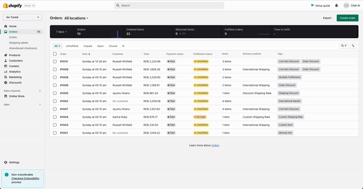
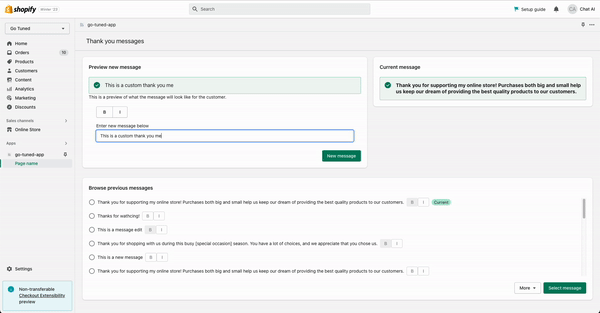
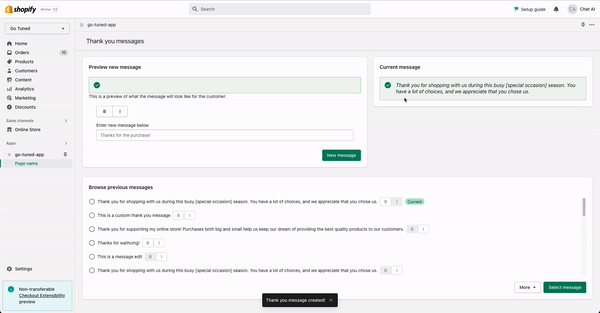
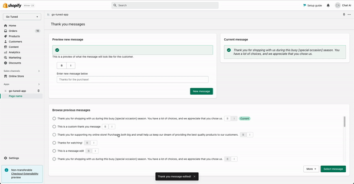
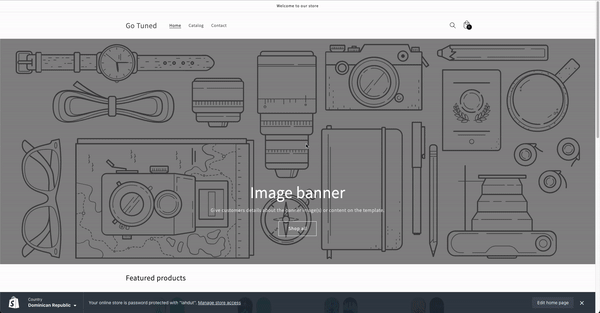

# Shopify Custom Thanks App

This is an app in response to this prompt:

- Build a basic Shopify app. Your Shopify app should allow merchants to set a custom thank you message for their customers. The message should appear at - - the top of their store’s order confirmation page. This message should be persisted in some database with previous versions of the message being retained. - A merchant should be able to create, retrieve (see what’s currently stored), update, and delete their thank you message. They should also be able to - - - provide basic formatting to their message such as bold and italics.

- The app should integrate with Shopify’s merchant admin experience and follow Shopify’s guidelines and conventions as closely as possible. You should be - - able to successfully install your app on a test Shopify store. Your app should work well with Shopify’s Dawn storefront theme, at a minimum.

## Shopify store:

[https://go-tuned.myshopify.com](https://go-tuned.myshopify.com/)

## Walkthrough for Admin

Admin order journey to app:

## Walkthrough for Customer

Customer order status page:

